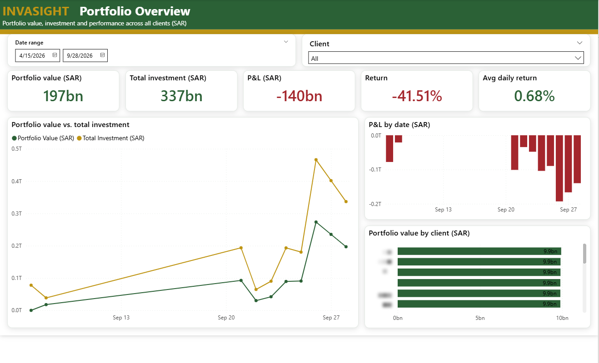
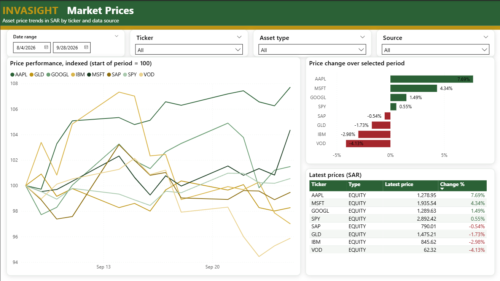
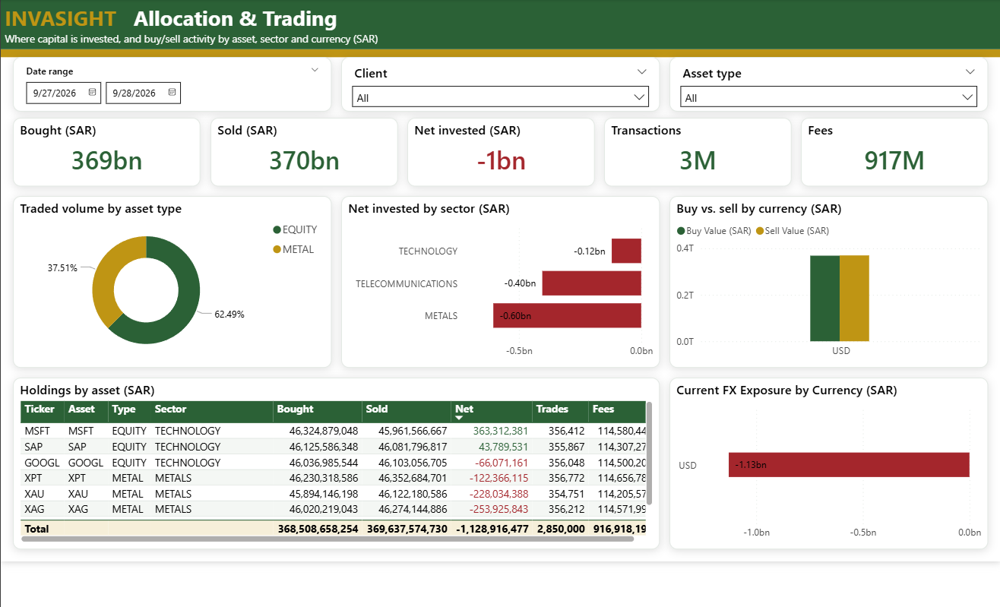
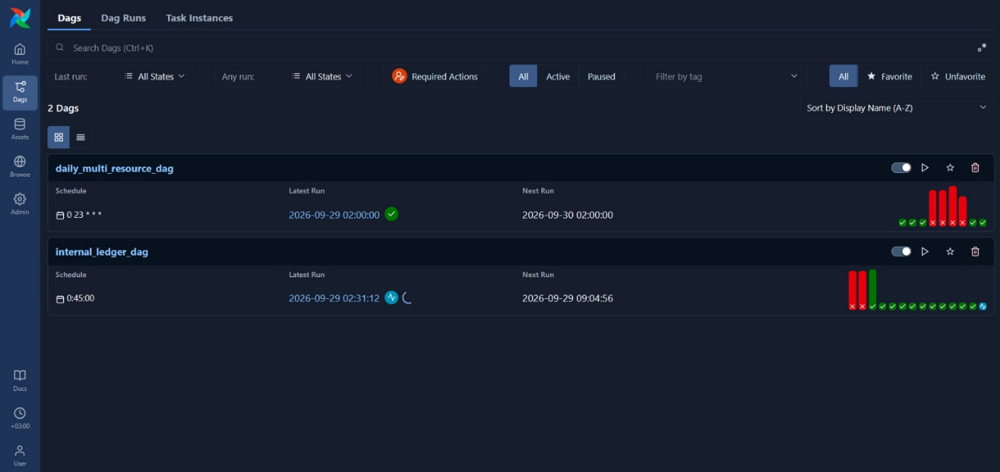
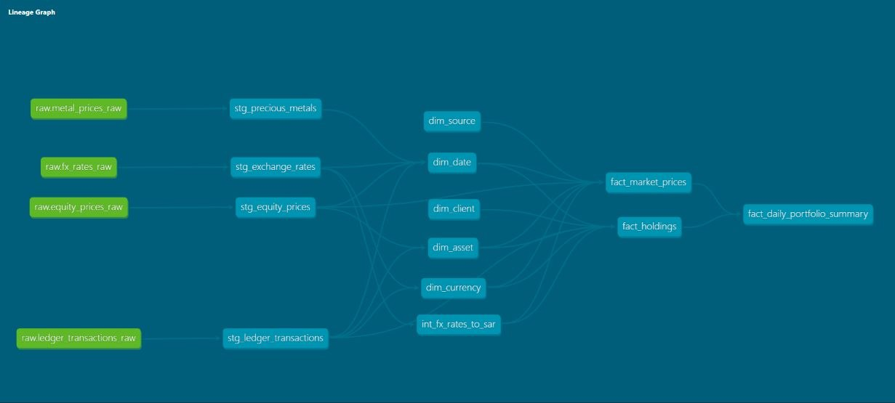
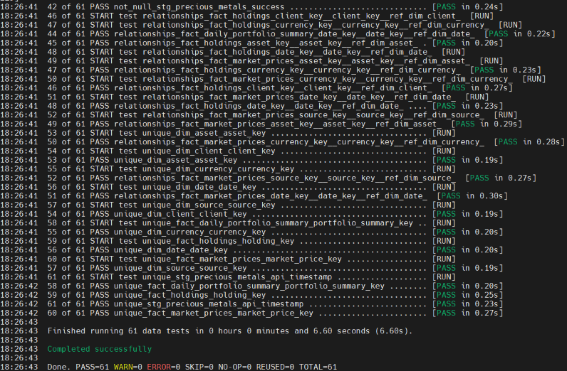
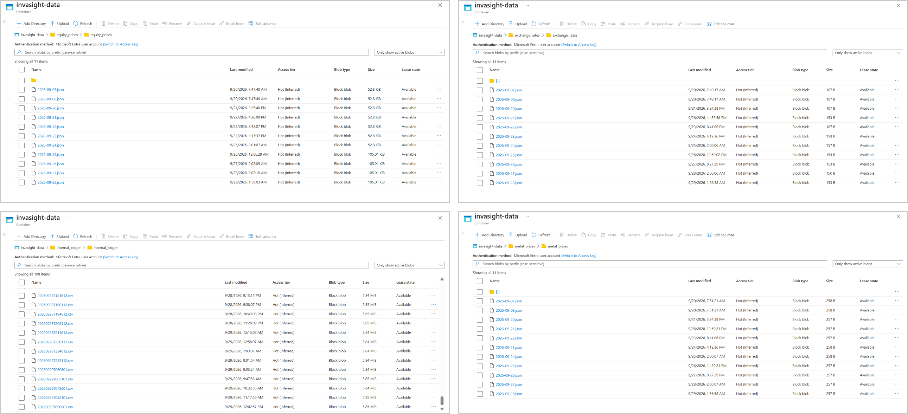
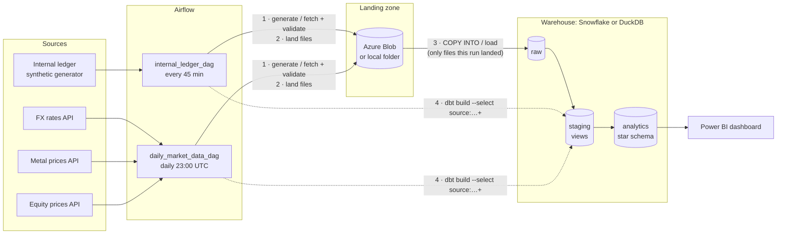

# InvaSight: investment portfolio data pipeline

An ELT pipeline for a small investment firm's reporting. It ingests an internal
transaction ledger plus daily FX rates, precious-metal prices and equity
prices, lands them as raw files, loads them into a warehouse, models them with
dbt into a star schema valued in Saudi riyals (SAR), and serves a portfolio
dashboard. Airflow orchestrates every step.

It started as a team capstone project for the **Saudi Digital Academy (SDA)
Data Engineering bootcamp**. It ran on
**Azure Blob Storage + Snowflake + Power BI**, with Airflow in Docker. My part
was orchestration and integration: the Airflow DAGs, the landing and loading
logic, the Snowflake loading, CI/CD and the dashboard wiring. This public
version adds a **local mode** (filesystem + DuckDB + fake sample data), so the
whole pipeline runs with one `docker compose up` and no cloud accounts.



<details>
<summary>More screenshots</summary>

| | |
|---|---|
|  |  |
| Market prices page | Allocation & trading page |
|  |  |
| Both DAGs in Airflow | dbt lineage graph |
|  |  |
| dbt test run | Landing zone in Azure Blob, one folder per source |

The dashboard screenshots come from the original Snowflake deployment. All
ledger data in them is synthetic, and client names are blurred.
</details>

## Architecture




**Data model**: `analytics` is a star schema.

| Table | Grain |
|---|---|
| `fact_holdings` | one row per ledger transaction (BUY/SELL), with the FX rate used and the value in SAR |
| `fact_market_prices` | one row per asset, date and source, with the SAR price |
| `fact_daily_portfolio_summary` | one row per client and date: investment, value, fees, return, P&L |
| `dim_asset`, `dim_client`, `dim_currency`, `dim_date`, `dim_source` | one row per entity |

## Stack

| Layer | Original deployment | Local mode (this repo's default) |
|---|---|---|
| Orchestration | Apache Airflow 3 (Docker) | same |
| Landing zone | Azure Blob Storage (SAS) | `data/landing/` on disk |
| Warehouse | Snowflake | DuckDB file |
| Transformation | dbt Core + dbt_utils | same models, `dbt-duckdb` |
| Market data | exchangeratesapi.io, metalpriceapi.com, Alpha Vantage | replayed from `data/sample/` (or real APIs) |
| Secrets | AWS Secrets Manager / env vars | none needed |
| Dashboard | Power BI (DirectQuery) | screenshots only (see *What I'd do next*) |
| CI | GitHub Actions | GitHub Actions |

## Run it

### With Docker (full Airflow)

Requires Docker Desktop / Docker Engine with Compose v2.

```bash
cp .env.example .env          # optional: defaults are local mode + sample data
docker compose up -d --build
```

Open <http://localhost:8080>. Login is disabled for this local demo. Then:

1. Unpause and trigger **`daily_market_data_dag`**. It lands the sample FX,
   metal and equity files, loads them into DuckDB and runs dbt.
2. Unpause and trigger **`internal_ledger_dag`**. It generates a ledger batch
   (plus the sample history on its first run), loads it and runs dbt.

Or use the CLI:

```bash
docker compose exec airflow airflow dags unpause daily_market_data_dag
docker compose exec airflow airflow dags trigger daily_market_data_dag
docker compose exec airflow airflow dags unpause internal_ledger_dag
docker compose exec airflow airflow dags trigger internal_ledger_dag
```

The warehouse is written to `data/warehouse/invasight.duckdb`. To browse it
after a run, stop the container first (DuckDB allows a single writer):

```bash
docker compose stop
duckdb data/warehouse/invasight.duckdb \
  "select * from analytics.fact_daily_portfolio_summary limit 10"
docker compose down            # when finished
```

### Without Docker (quick check, also what CI runs)

```bash
python -m venv .venv && source .venv/bin/activate   # Windows: .venv\Scripts\activate
pip install -r requirements-dev.txt
python scripts/run_local.py
```

This calls the same task functions the DAGs use, in DAG order, and then runs
`dbt build`.

### Against the real services

Set `MARKET_DATA_SOURCE=api` and the three API keys to call the real market
data APIs. Set `PIPELINE_MODE=cloud` plus the Snowflake and Azure settings in
`.env.example` to use Blob Storage and Snowflake. Run
[`warehouse/snowflake/setup.sql`](warehouse/snowflake/setup.sql) once first.

## dbt tests

`dbt build` runs **79 data tests** alongside the 13 models, and any failure
fails the Airflow task:

- **Keys**: `unique` + `not_null` on every dimension and fact primary key;
  `dbt_utils.unique_combination_of_columns` on the natural grain of
  `stg_equity_prices` (ticker, date) and `stg_exchange_rates` (date, base,
  target).
- **Referential integrity**: `relationships` tests from every fact foreign key
  to its dimension.
- **Domains**: `accepted_values` for transaction type, asset type, source
  type, currency codes and API base currencies.
- **Ranges**: `dbt_utils.accepted_range` so prices, FX rates and quantities
  are strictly positive.
- **Completeness**: `not_null` on every parsed price, timestamp and lineage
  column (`file_name`, `loaded_at`).
- **Business rules** (singular tests in `dbt/invasight/tests/`):
  - `assert_holdings_have_fx_rate`: every transaction found an FX rate on or
    before its date. A missing rate would otherwise drop out of every SAR
    total without anyone noticing.
  - `assert_sar_rate_is_one_for_sar`: a sanity check on the FX triangulation.

Validation also runs earlier, at extraction. Each fetch checks its payload
before landing it (expected symbols present, values positive, ledger totals
consistent with quantity × price ± fees), so bad data never reaches the
warehouse.

## Design decisions

**Two DAGs, split by source rather than one pipeline DAG.** The ledger is
internal, high-volume and arrives every 45 minutes. Market data comes from
three rate-limited external APIs once a day. Splitting them gives each its own
schedule, retries and failure domain: an API outage or rate-limit error pauses
market data but never blocks ledger ingestion. Each DAG ends with a dbt build
that selects only `source:raw.<its tables>+`, so a ledger run rebuilds only
the ledger-dependent models instead of the whole project.

**Parallel fetches, one dbt build.** In the market DAG, the three fetch → load
branches run in parallel and fan into a single `dbt_build`. dbt runs once,
after all three sources are in, rather than three times on half-updated data.

**ELT with an as-delivered RAW layer.** API responses are stored as whole JSON
documents (`VARIANT` / `JSON`), and ledger CSV columns are stored as text. All
parsing and typing happens in dbt staging models. When an API adds a field or
changes a type, loads keep working, and history can be re-parsed later without
re-fetching.

**Load exactly what this run landed, at most once.** Each fetch task returns
the paths it landed. The load task pulls them from XCom and loads only those
files (`COPY INTO … FILES = (…)` in Snowflake). Snowflake's load history (and
an equivalent `_load_history` table in DuckDB) makes retries safe: a file is
never loaded twice. `ON_ERROR = CONTINUE` is deliberately off, so a bad file
fails the task and dbt doesn't run on partial data.

**One warehouse slot.** Every load and dbt task runs in a one-slot Airflow
pool (`warehouse_pool`). On DuckDB this respects its single-writer model. On
Snowflake it stops the two DAGs' dbt builds from racing on the same tables.

**FX normalisation in two steps.** The free FX plan returns only EUR-based
rates, so the fetch task rebases them to USD (to match the other sources).
`int_fx_rates_to_sar` then turns everything into SAR per unit, and it still
handles older EUR-based loads. Facts take the latest rate on or before each
date with an **ASOF join**, so weekend and intraday rows get the last
published rate. A missing rate stays `NULL` and fails a test, instead of
defaulting to 1.0.

**One set of models, two warehouses.** The few dialect differences (JSON
paths, `FLATTEN` vs `json_each`, ASOF join syntax, epoch conversion) live in
`adapter.dispatch` macros in [`macros/cross_db.sql`](dbt/invasight/macros/cross_db.sql).
The same models build on Snowflake in production and on DuckDB locally and in
CI.

**Deterministic synthetic ledger.** There was no real ledger, so a generator
plays the source system. It's seeded from the run's interval timestamp, so a
retry or backfill reproduces the same rows, while every interval differs.

**Secrets are read lazily.** API keys come from environment variables, or AWS
Secrets Manager when deployed. They're fetched inside the task, not at module
import, so DAG parsing never depends on the secret store being reachable.

**dbt in its own virtualenv inside the Airflow image.** This keeps dbt's
dependencies from clashing with Airflow's. An earlier version ran dbt on a
separate VM over SSH. Bundling it into the image removed a host to secure and
patch, along with an SSH key to manage.

## Repo layout

```
airflow/
  Dockerfile                 Airflow 3 + providers; dbt in a separate venv
  dags/
    internal_ledger_dag.py
    market_data_dag.py
    pipelines/               config, landing zone, sources, warehouse loading, operator factories
  tests/test_dag_integrity.py
dbt/invasight/
  macros/cross_db.sql        Snowflake/DuckDB dialect differences
  models/staging/            parse + type + dedupe RAW (views)
  models/intermediate/       FX -> SAR (ephemeral)
  models/analytics/          star schema (tables)
  tests/                     singular business-rule tests
data/sample/                 fake API responses + ledger batches (regenerate: scripts/generate_sample_data.py)
scripts/run_local.py         whole pipeline without Airflow (used by CI)
warehouse/snowflake/         one-time Snowflake setup (cloud mode)
docker-compose.yaml
.env.example
```

## What I'd do next

- **Incremental models.** `fact_holdings` is fully rebuilt each run. At 50,000
  ledger rows every 45 minutes it should be `incremental` on `batch_id`, with
  a merge on `holding_key`.
- **Net positions.** The daily summary values each day's traded quantity
  (BUY and SELL both add). A running net position per client and asset
  (cumulative `signed_quantity`) would give a true holdings value and P&L.
- **Source freshness.** Add `loaded_at_field` + `dbt source freshness` as a
  DAG step, alerting when a market feed stops updating, not just when it fails.
- **Open dashboard.** Rebuild the Power BI pages in Evidence or Streamlit
  on top of DuckDB, so the dashboard runs locally too.
- **Infrastructure as code.** Terraform for the storage account, Snowflake
  objects and the Airflow host, with private networking and no public SSH.
  Rotate secrets automatically instead of by hand.
- **Deploy pipeline.** Extend CI to push the image to a registry and roll it
  out on merge to `main`. The original had this; it's left out here because
  there's no shared host to deploy to.
- **dbt docs** published to GitHub Pages from CI.
