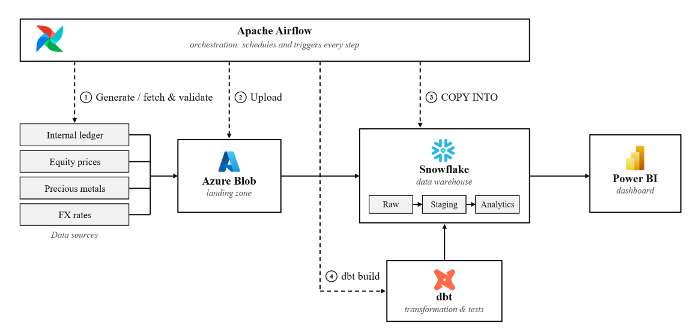


# InvaSight
### Multi-Cloud Automated Investment Data Pipeline

**InvaSight** is an enterprise-grade investment data pipeline engineered for **wealth managers**. It seamlessly ingests multi-asset financial ledgers alongside live global market data, automatically standardizing all asset holdings and valuations into **Saudi Riyals (SAR)** within a central analytical warehouse.

>*developed by a team of 4 as our capstone project for the Saudi Digital Academy (SDA) Data Engineering Bootcamp, in collaboration with WeCloudData.*

---

## Quick Links
- [Architecture](#architecture)
- [How It Works](#how-it-works)
- [Key Features](#key-features)
- [Tech Stack](#tech-stack)
- [Getting Started](#getting-started-local-development)
- [Leadership & Contributions](#leadership--individual-contributions)
- [Team Credits](#team--credits)

---

## Architecture

### Pipeline Architecture



### Cloud Infrastructure



1. **CI/CD Pipeline:** Code flows from GitHub via **GitHub Actions** directly into **AWS**.
2. **Container Orchestration:** Docker images are built on an EC2 Docker engine; **Apache Airflow** runs on `k8s-master` and **dbt** executes on `k8s-worker01` inside an AWS EC2 Kubernetes cluster.
3. **Secure Landing:** Airflow ingests market data into the **Azure Blob Storage (ADLS)** Bronze layer.
4. **Warehouse Integration:** **Snowflake** connects to Bronze and Golden layers using short-lived Azure SAS tokens for maximum security.

---

## How It Works

| Step | Action | Description |
| :--- | :--- | :--- |
| **1. Ingestion** | **Airflow** | Collects raw data from the internal ledger (every 45 mins) and the market APIs (daily FX, precious metals and equities), validates each payload, and lands it in the Azure ADLS Bronze layer. Loads are idempotent, so only the current run's payloads are processed and retries are safe. |
| **2. Transformation** | **dbt Core** | Converts raw entities into a SAR-denominated Galaxy Schema with instant QA assertions. |
| **3. Serving** | **Power BI** | Feeds executive dashboards for wealth managers with up-to-the-minute asset allocation insights. |

---

## Key Features

- **Resilient Dual-DAG Schedules:** Independent Airflow DAGs tailored for high-frequency internal transactions and daily market price feeds.
- **SAR Valuation Engine:** Automated conversion using exact date-matched FX rates to consolidate global assets into Saudi Riyals.
- **79 Automated dbt Quality Gates:** 13 dbt models protected by strict testing for primary keys, referential integrity, and business logic.
- **Zero-Cloud Local Mode:** Run the full pipeline locally out of the box using **DuckDB** with zero cloud credentials required.

---

## Analytics Data Model

The analytical warehouse (`analytics`) utilizes a **Galaxy Schema** architecture consisting of three core fact tables supported by shared dimensions:

* **Fact Tables:** `fact_holdings` · `fact_market_prices` · `fact_daily_portfolio_summary`
* **Dimension Tables:** `dim_asset` · `dim_client` · `dim_currency` · `dim_date` · `dim_source`

---

## Tech Stack

| Architectural Layer | Production Cloud Environment | Local Standalone Mode (Default) |
| :--- | :--- | :--- |
| **Language** | Python 3.10+ | Python 3.10+ |
| **Orchestration** | Apache Airflow 3 (AWS EC2 / K8s) | Apache Airflow 3 (Docker Compose) |
| **Landing Storage** | Azure Blob Storage (ADLS Gen2) | `data/landing/` local directory |
| **Data Warehouse** | Snowflake | DuckDB (`data/warehouse/invasight.duckdb`) |
| **Transformation** | dbt Core + `dbt_utils` | dbt Core (`dbt-duckdb`) |
| **Market Data APIs** | ExchangeRatesAPI, MetalPriceAPI, Alpha Vantage | Mock sample files / Local APIs |
| **BI & Visualization** | Power BI Desktop & Service | Power BI / Local Warehouse CLI |
| **CI/CD & DevSecOps** | GitHub Actions, AWS Secrets Manager | GitHub Actions |

---

## Getting Started (Local Development)

### Prerequisites
* **Docker Desktop** or **Docker Engine** with Compose v2.

### Option A: Running with Docker (Recommended)

1. **Clone repository and set environment configuration:**
   ```bash
   cp .env.example .env
   ```

2. **Spin up local Airflow & DuckDB pipeline:**
   ```bash
   docker compose up -d --build
   ```

3. **Trigger Pipelines:**
   Navigate to `http://localhost:8080`, unpause, and run `daily_market_data_dag` and `internal_ledger_dag`.

4. **Query Pipeline Results:**
   ```bash
   # Stop containers to release DuckDB locks
   docker compose stop

   # Query analytics tables
   duckdb data/warehouse/invasight.duckdb "SELECT * FROM analytics.fact_daily_portfolio_summary LIMIT 10;"

   docker compose down
   ```

---

### Option B: Running Without Docker

```bash
# Initialize and activate virtual environment
python -m venv .venv
source .venv/bin/activate  # On Windows: .venv\Scripts\activate

# Install dependencies and execute pipeline script
pip install -r requirements-dev.txt
python scripts/run_local.py
```

---

### Switching to Cloud Production Mode

1. Run `warehouse/snowflake/setup.sql` in your Snowflake instance.
2. Update `.env`: Set `PIPELINE_MODE=cloud` and `MARKET_DATA_SOURCE=api`.
3. Fill in your AWS, Azure ADLS, and Snowflake credentials in `.env`.

---

## Leadership & Individual Contributions

As **Project Lead & Data Platform Architect**, I led end-to-end strategy, multi-cloud implementation, and DevSecOps posture:

* **Project Management & Cost Optimization:** Authored proposals and timelines while optimizing API request budgets to operate 100% within free tiers.
* **Multi-Cloud Architecture:** Designed cross-cloud pipelines bridging AWS, Azure ADLS, and Snowflake; containerized Airflow/dbt on an AWS EC2 Kubernetes cluster.
* **Security & Incident Response:** Managed threat containment during a server breach, migrated all secrets into AWS Secrets Manager, implemented short-lived Azure SAS tokens, and enforced tight Git exclusion policies.
* **Transformation & Governance:** Configured dbt orchestration, engineered custom reusable SQL macros, built FX-to-SAR currency conversion models, and implemented 79 automated QA tests.

---

## Team & Credits

* **Maryam Alotaibi**
* **Fayhaa Alharbi**
* **Rawan Alaklabi**
* **Hanoof Alassiri**
